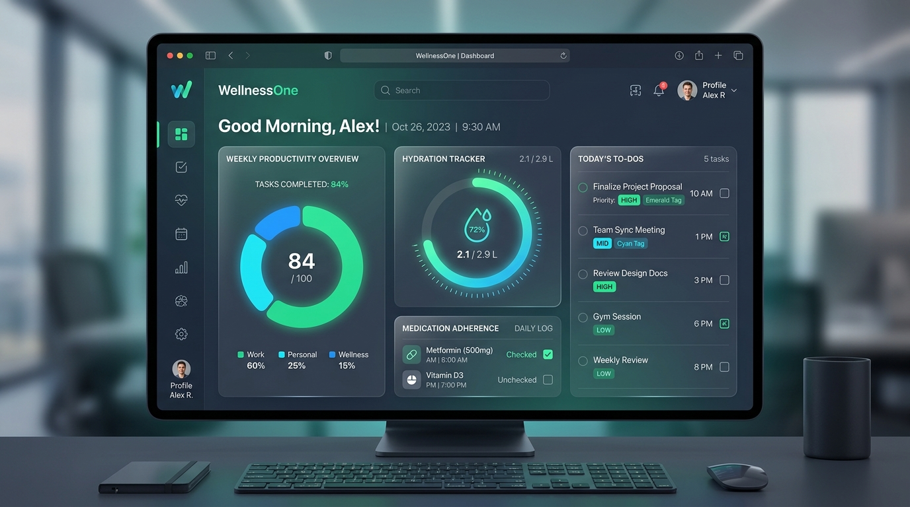
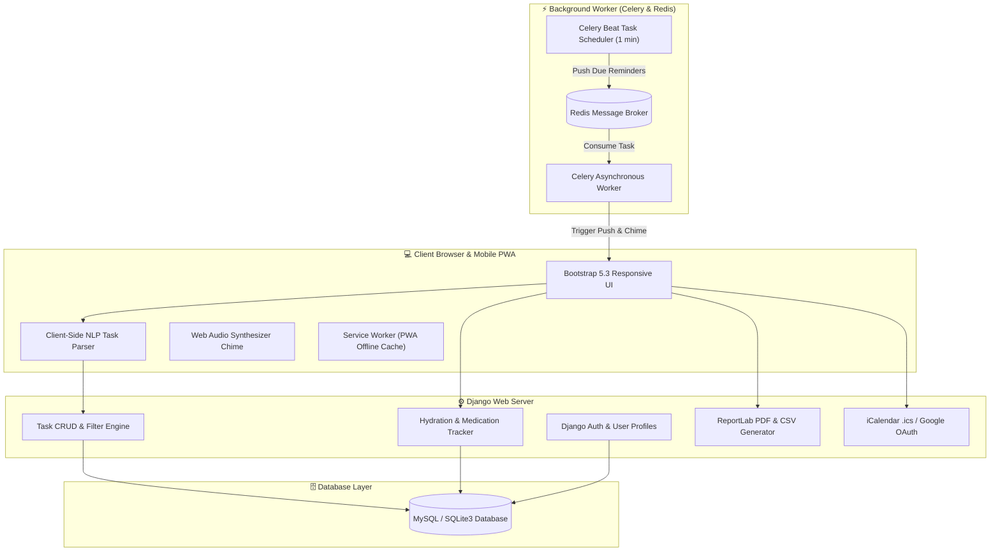
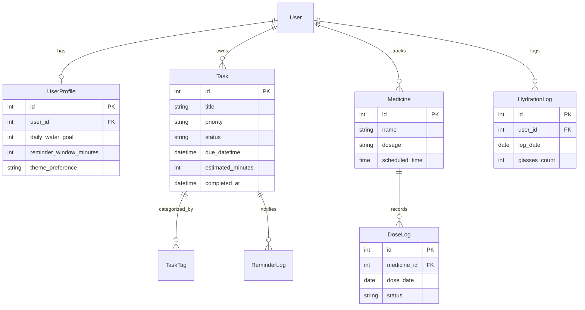

<div align="center">

# 🌿 Digital To-Do &amp; Wellness Manager
### *High-Velocity Task Execution Meets Proactive Health & Habit Intelligence*

<br/>



<br/>
<br/>

[](https://github.com/karnatinikhil-sudo/CSA-0801-Python-programming/actions)
[](https://www.python.org/)
[](https://www.djangoproject.com/)
[](https://docs.celeryq.dev/)
[](docker-compose.yml)
[]()
[]()
[-brightgreen.svg?logo=pytest&logoColor=white)](tests/)
[](LICENSE)
[]()

<br/>

**Digital To-Do & Wellness Manager** is a production-ready, full-stack Python web application designed to solve burnout and cognitive overload in modern workflows. By seamlessly integrating **frictionless natural-language task management** with a **centralized health spotlight** (hydration tracking, medication adherence, and ergonomics reminders), the system ensures productivity never comes at the cost of personal wellbeing.

[Key Features](#-key-features) • [System Architecture](#-system-architecture) • [Live Quickstart](#-quick-start) • [Database Schema](#-database-schema) • [API Matrix](#-api--routes-matrix) • [Author](#-author--maintainer)

</div>

---

## 💡 The Problem & The Solution

| The Problem | How Digital To-Do & Wellness Solves It |
|---|---|
| ⏳ **Friction in Task Capture**: Complex forms with 10 inputs cause users to abandon task tracking. | **⚡ Natural Language Processing**: Type `"Prepare quarterly audit every Friday at 5pm high priority #Finance"` and all fields auto-populate in < 10 seconds. |
| 🪑 **Sedentary Burnout & Neglected Health**: Traditional to-do apps encourage non-stop work without physical health cues. | **💧 Central Wellness Spotlight**: Real-time hydration progress ring, rotating posture/eye-strain breaks, and 1-tap medication logging directly on the main dashboard. |
| 🔔 **Notification Fatigue & Missed Deadlines**: Ignored static notification banners lead to overdue tasks. | **🔊 3-Stage Escalating Audio Reminders**: Gentle 30-min alert $\rightarrow$ Loud synthesized Web Audio chime $\rightarrow$ Persistent overdue warning. |
| 📊 **Lack of Completion Insights**: Users don't know where their time goes. | **📈 Precision Duration Tracking & Chart.js**: Measures exact minutes spent per task with downloadable **PDF & CSV** analytics reports. |

---

## 🌟 Key Features

### 1. ⚡ Ultra-Fast Task Management
- **NLP Input Engine**: Client-side regex & keyword tokenizer that extracts titles, deadlines, repeat schedules (`daily`, `weekly`, `weekdays`), priority tags (`#High`, `#Low`), and categories in real-time.
- **Single-Tap AJAX Toggles**: Check off tasks between `Pending`, `In Progress`, and `Completed` with zero page reloads.
- **Precision Time Tracking**: Tracks exact duration from task creation to completion (e.g., `"Completed in 1h 45m"`), generating velocity metrics.
- **Universal `.ics` Calendar Export**: 1-click download of calendar invites for Google Calendar, Apple Calendar, and Outlook.

### 2. 💧 Proactive Health & Wellness Dashboard
- **Interactive Hydration Ring**: SVG progress ring visualizing daily water consumption against customizable goals (default 8 glasses) with quick `+1 Glass` logging.
- **16+ Rotating Wellness Tips**: Micro-breaks for 20-20-20 eye strain, posture alignment, breathing exercises, and hydration nudges.
- **Medication Adherence Regimen**: Track daily medication doses with 1-tap `Taken` / `Skipped` / `Snooze 15m` actions and a rolling 7-day adherence scorecard.

### 3. 🔔 Background Celery Workers & Alarm Chimes
- **Celery Beat Cron**: Scans approaching task deadlines and medication windows every 60 seconds.
- **Web Audio API Chime**: Client-side audio synthesizer producing a distinct dual-tone chime without external audio file dependencies.
- **Web Push Notifications**: Service Worker integration for system notifications even when the browser tab is idle.

### 4. 📊 Downloadable Reports & Data Visualizations
- **Chart.js Dashboards**: Donut charts for status breakdown, priority distribution bars, and 7-day completion velocity curves.
- **Dynamic PDF Generation**: High-resolution branded reports generated server-side using **ReportLab**.
- **Structured CSV Export**: Instant export of filtered task history for spreadsheet analysis.

### 5. 📱 Progressive Web App (PWA)
- Offline support via Service Worker caching (`sw.js`).
- Standalone app-like windowing on Windows, macOS, Android, and iOS.

---

## 🏛️ System Architecture



---

## 🗄️ Database Schema



---

## 🚀 Quick Start

### Option A: 🐳 Docker One-Liner (Recommended for Everyone)

Run the entire application with Redis and Celery in a single command:

```bash
git clone https://github.com/karnatinikhil-sudo/CSA-0801-Python-programming.git
cd CSA-0801-Python-programming

docker compose up --build
```
> Open **`http://localhost:8000/`** in your browser!

---

### Option B: 🐍 Local Python Setup

```bash
# 1. Clone repository
git clone https://github.com/karnatinikhil-sudo/CSA-0801-Python-programming.git
cd CSA-0801-Python-programming

# 2. Create virtual environment
python -m venv .venv
# Windows:
.venv\Scripts\activate
# Linux/macOS:
source .venv/bin/activate

# 3. Install dependencies
pip install -r requirements.txt

# 4. Initialize database and load seed tips
python manage.py migrate
python manage.py loaddata fixtures/wellness_tips.json

# 5. Start development server
python manage.py runserver
```
> Open **`http://127.0.0.1:8000/`** to interact with the application.

---

## 🔑 Demo Login Credentials

For quick testing without creating a new account:
- **Username**: `demouser_e2e`
- **Password**: `DemoPass123!`

*(You can also click **Sign Up** on the login screen to create a custom profile instantly).*

---

## 🧪 Automated Testing Suite

The repository includes a test suite covering task management, natural language parsing, hydration tracking, medication adherence, reminders, and calendar exports.

```bash
# Run tests with Django test runner
python manage.py test tests/

# Run tests with pytest
pytest -v
```

---

## 📋 API & Routes Matrix

| Endpoint | Method | Description |
|---|---|---|
| `/` | `GET` | Central Dashboard with Hydration Ring, Task KPIs & Wellness Tips |
| `/tasks/` | `GET`, `POST` | Task List View, Filters, and New Task Creation |
| `/tasks/<id>/toggle/` | `POST` | AJAX single-tap task status toggle (`Pending` $\leftrightarrow$ `Completed`) |
| `/tasks/<id>/ics/` | `GET` | Download universal `.ics` calendar file for a specific task |
| `/health/water/increment/` | `POST` | AJAX 1-tap logging of `+1 Glass` of water |
| `/health/medicines/` | `GET`, `POST` | Medication schedule & 7-day adherence scorecard |
| `/health/medicines/<id>/dose/` | `POST` | Record dose status (`taken`, `skipped`, `snoozed`) |
| `/reports/` | `GET` | Performance analytics page with PDF and CSV export links |
| `/reports/pdf/` | `GET` | Generates dynamic ReportLab PDF summary |
| `/reports/csv/` | `GET` | Exports complete task history as CSV |
| `/calendar/settings/` | `GET`, `POST` | Google Calendar OAuth 2.0 synchronization settings |
| `/accounts/profile/` | `GET`, `POST` | User profile, notification preferences & custom water goals |

---

## 🛠️ Technology Stack

```
Frontend:    HTML5 • Vanilla CSS3 • Modern JavaScript (ES6+) • Bootstrap 5.3 • Chart.js
Backend:     Python 3.10-3.14 • Django 6.1 / 5.1 • Django ORM • PyMySQL / SQLite3
Async Jobs:  Celery 5.6 • Redis 7.x • Celery Beat Periodic Scheduler
Reports:     ReportLab PDF Engine • iCalendar Engine • Web Audio API Chimes
DevOps:      Docker • Docker Compose • GitHub Actions CI/CD • PWA Service Workers
```

---

## 🤝 Open Source & Contributing

Contributions, issues, and feature suggestions are always welcome!
1. Fork the repository
2. Create your branch (`git checkout -b feature/AmazingFeature`)
3. Commit your changes (`git commit -m 'feat: add AmazingFeature'`)
4. Push to the branch (`git push origin feature/AmazingFeature`)
5. Open a Pull Request

Please review our [CONTRIBUTING.md](CONTRIBUTING.md) and [CODE_OF_CONDUCT.md](CODE_OF_CONDUCT.md).

---

## 👨‍💻 Author & Maintainer

<div align="center">

### **Nikhil Karnati**
*Full-Stack Engineer & Python Developer*

[](https://github.com/karnatinikhil-sudo)
[](https://linkedin.com)
[](https://github.com/karnatinikhil-sudo)

</div>

---

## 📄 License

Distributed under the **MIT License**. See [`LICENSE`](LICENSE) for more information.